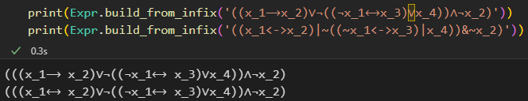
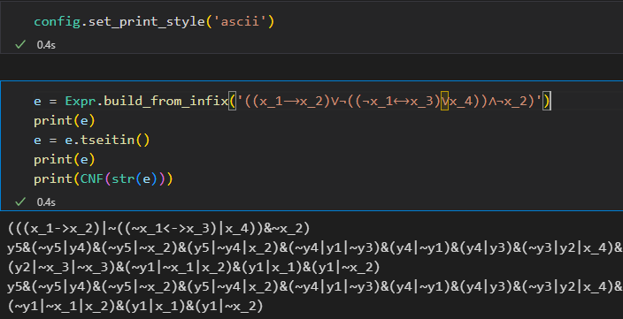
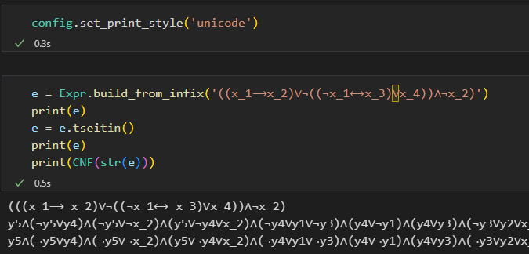
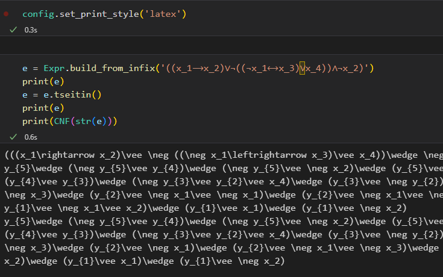
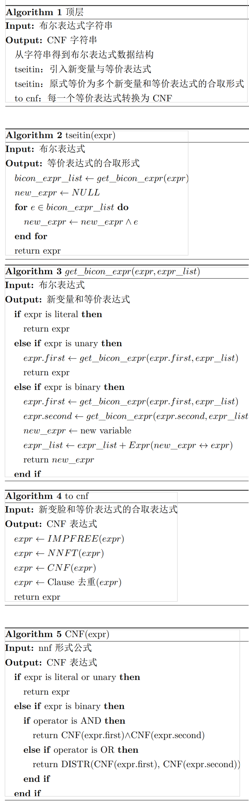

# tseitin-encoding-3cnf 

实现Tseitin编码算法，将任何布尔表达式转换为3-CNF表达式

如

$$
\begin{aligned}
&((𝑥_1→𝑥_2 )∨¬((¬𝑥_1↔𝑥_3 )∨𝑥_4 ))∧¬𝑥_2\\
&(𝑥_1∨𝑥_2∨𝑥_3∨𝑥_4∨𝑥_5 )∧(𝑥_2∨𝑥_3∨𝑥_4∨𝑥_5∨𝑥_6 )∧(𝑥_3∨𝑥_4∨𝑥_5∨𝑥_6∨𝑥_7)\\
&((𝑥_1↔𝑥_2 )↔(x_3↔𝑥_4 ))↔((𝑥_1↔𝑥_3 )↔(𝑥_2↔𝑥_4 ))
\end{aligned}
$$

- 进行了简单的去重，还不够完善

- 输入采用字符串输入，可以是ascii、unicode形式的字符串

- 支持输入中缀和后缀表达式

- 支持ascii、unicode、latex格式输出

## 算法

